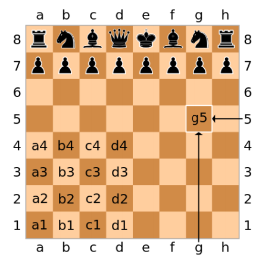

# App scacchi 

## Descrizione

Questa applicazione di scacchi è stata sviluppata per consentire a due giocatori di sfidiarsi utilizzando la [notazione algebrica abbreviata italiana](https://it.wikipedia.org/wiki/Notazione_algebrica). Il progetto è stato realizzato seguendo una metodologia <b>Agile</b> in tre sprint, con l'obiettivo di produrre un **Minimal Viable Product (MVP)** funzionale e completo.

## Documentazione

Il progetto include una documentazione completa disponibile nella cartella `docs/`:

### 📋 Documentazione Tecnica
- **[Report.md](docs/Report.md)** - Descrizione dettagliata di tutte le fasi della progettazione dell'applicazione, inclusi i tre sprint di sviluppo e le decisioni architetturali adottate
- **[Manuale.md](docs/Manuale.md)** - Guida completa all'utilizzo dell'applicazione con comandi, screenshot esemplificativi e istruzioni per il gioco

### 👥 Documentazione del Team
- **[CODE_OF_CONDUCT.md](CODE_OF_CONDUCT.md)** - Codice di condotta adottato dal team per garantire un ambiente di lavoro collaborativo e rispettoso
- **[ISPIRATORE.md](ISPIRATORE.md)** - Breve biografia del personaggio che ha ispirato il nome del team "Le Cun"
- **[Guida configurazione repo.md](docs/Guida%20configurazione%20repo.md)** - Istruzioni per la configurazione e gestione del repository

## Come Iniziare

Per iniziare l'utilizzo dell'applicazione, è possibile consultare il [Manuale.md](docs/Manuale.md) che contiene tutte le informazioni necessarie per l'utilizzo del gioco.

## Architettura

L'applicazione è stata sviluppata in Python seguendo il pattern architetturale **Model-View-Controller (MVC)**, con una chiara separazione delle responsabilità tra i package `boundary`, `control` ed `entity`.

## Team Le Cun

Il progetto è stato sviluppato dal team "Le Cun", il cui nome trae ispirazione da una figura di rilievo nel campo dell'intelligenza artificiale. Per maggiori dettagli, è possibile consultare il file [ISPIRATORE.md](ISPIRATORE.md).

---

*Progetto sviluppato nell'ambito del corso di Ingegneria del Software - Università degli Studi di Bari Aldo Moro*
