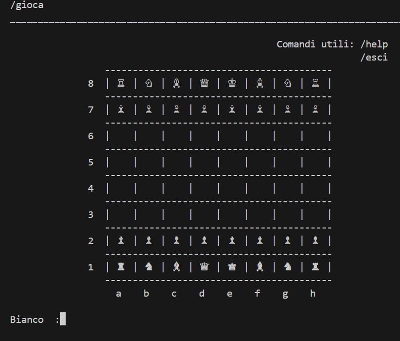
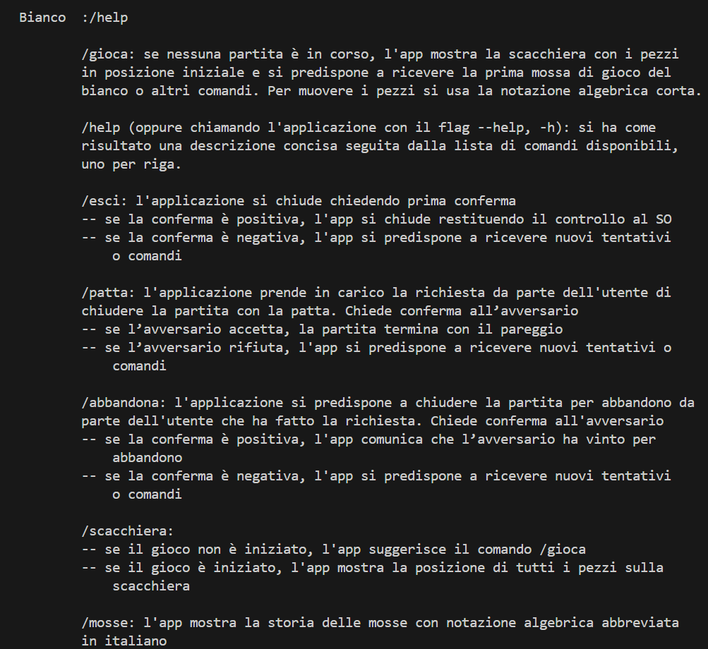
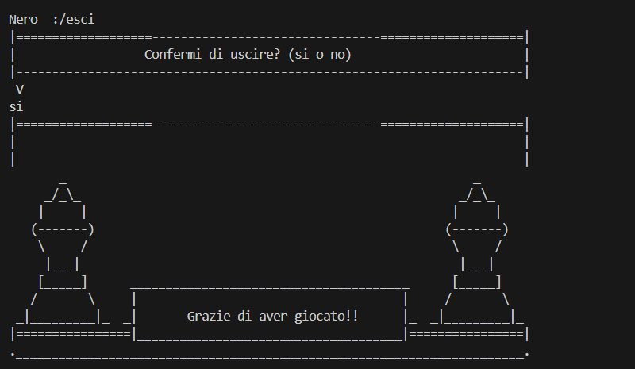
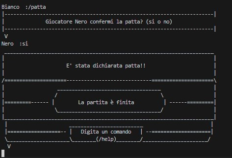
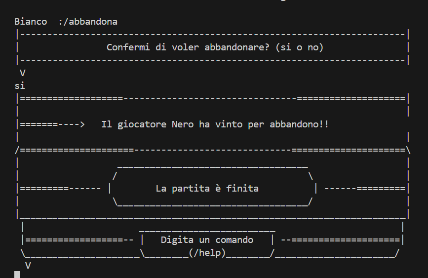
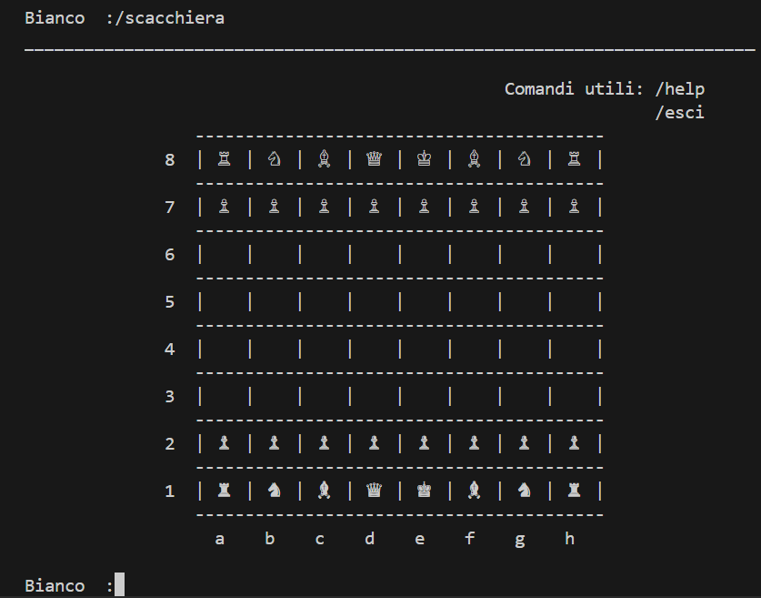
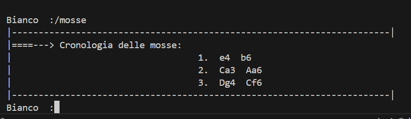
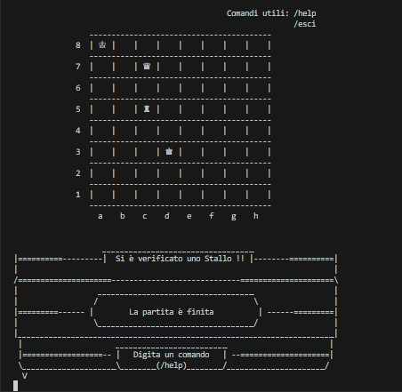

# UTILIZZO SOFTWARE

Via terminale si possono inserire i comandi per muoversi nell'app. 

## INPUT VALIDI:
- /gioca: se nessuna partita è in corso, l'app mostra la scacchiera con i pezzi in posizione iniziale e si predispone a ricevere la prima mossa di gioco del bianco o altri comandi. Per muovere i pezzi si usa la notazione algebrica corta.

- /help(oppure chiamando l'applicazione con il flag --help, -h): si ha come risultato una descrizione concisa seguita dalla lista di comandi disponibili, uno per riga.

- /esci: l'applicazione si chiude chiedendo prima conferma

        -- se la conferma è positiva, l'app si chiude restituendo il controllo al SO
        -- se la conferma è negativa, l'app si predispone a ricevere nuovi tentativi o comandi

- /patta: l'applicazione prende in carico la richiesta da parte dell'utente di chiudere la partita con la patta. Chiede conferma all’avversario

        -- se l’avversario accetta, la partita termina con il pareggio
        -- se l’avversario rifiuta, l'app si predispone a ricevere nuovi tentativi o comandi

- /abbandona: l'applicazione si predispone a chiudere la partita per abbandono da parte dell'utente che ha fatto la richiesta. Chiede conferma all'avversario

        -- se la conferma è positiva, l'app comunica che l’avversario ha vinto per abbandono
        -- se la conferma è negativa, l'app si predispone a ricevere nuovi tentativi o comandi

- /scacchiera:

        -- se il gioco non è iniziato, l'app suggerisce il comando /gioca
    

        -- se il gioco è iniziato, l'app mostra la posizione di tutti i pezzi sulla scacchiera

     
     

- /mosse: l'app mostra lo storico delle mosse con notazione algebrica abbreviata in italiano
 

 
 
 
 
 ## INPUT NON VALIDI:

-  Viene segnalato un input non valido quando viene digitato un movimento non compatibile con il pezzo indicato,oppure quando è digitata          una stringa che non è un comando o una mossa
    
    

-  Nel corso della partita una mossa è considerata illegale se lascia il proprio re sotto scacco (mossa illegale)
    

# NOTAZIONE ALGEBRICA 
- Simboli pezzi:  
    re       R    (♔)  
    donna    D    (♕)      
    torre    T    (♖)     
    alfiere  A    (♗)     
    cavallo  C    (♘)     
    pedone  -non si mette alcuna lettera -      (♙)      
**I simboli dei pezzi devono essere scritti esclusivamente con la lettera maiscola,**
**in caso contrario la mossa non sarà considerata valida.**    

- Muovere pezzo:  
    Simbolo pezzo + colonna + riga → "Cc4"
    

- Catturare pezzo:  
    Simbolo pezzo + x + colonna + riga → "Txe5"
    

    
    
    

- Arrocco:
    
    - Arrocco corto:  (Caso in cui il re si scambia con la torre più vicina a lui)
    0-0
    

    
    
    

    - Arrocco lungo:  (Caso in cui il re si scambia con la torre più lontana da lui)
    0-0-0
    

    
    
    

- Promozione:  
    colonna + riga + = + Simbolo pezzo (D-T-C-A) → "e8=D"
    
    

    
    
    

- Promozione con cattura:
    colonna di partenza + x + colonna + riga + = + Simbolo pezzo (D-T-C-A) → "gxh8=A"
    
    
    
    

- **en passant** :
    - colonna del pedone che cattura + x + colonna del pedone catturato + riga del pedone catturato → "exd6" 
    
    

    
    
    
    

- **Eccezioni**  
  Se due pezzi uguali possono muoversi/catturare nella stessa casella, allora:  

  - Se i due pezzi sono sulla stessa colonna (un cavallo in a8 e uno in a6), allora si usa tale notazione:  
    Simbolo pezzo + riga + "eventuale x se si cattura" + colonna + riga → "C6c7 - C6xc7"
    

  - Se i due pezzi sono sulla stessa riga (un cavallo in e2 e uno in g2), allora si usa tale notazione:  
    Simbolo pezzo + colonna + "eventuale x se si cattura" + colonna + riga → "Cef4 - Cexf4"
    

  - Se più di 2 pezzi ("3/4") possono catturare lo stesso pezzo, allora si usa tale notazione:  
    Simbolo pezzo + colonna + riga + x + colonna + riga

- **Condizioni per la fine del gioco** 
    - Scacco Matto :
        Se nessuna delle mosse che il giocatore può effettuare è in grado di liberare il re dallo scacco, si tratta di scacco matto e la partita termina con la vittoria dell'avversario.
        
        
        
        
    
    - Stallo : 
        Se il re non si trova sotto scacco ma non è possibile effettuare alcuna mossa legale (ad esempio se si ha solo il re in gioco ed esso non è sotto scacco ma tutte le case ad esso adiacenti sono minacciate), si tratta di stallo e la partita termina con un risultato di parità, non potendo il giocatore che si trova in questa condizione muovere senza contravvenire alle regole del gioco.
        
        
        
        
    
    - Comando dall'utente: 
        Tramite i comandi dell'utente la partita può concludersi:
             
            /patta: l'applicazione prende in carico la richiesta da parte dell'utente di chiudere la partita con la patta. Chiede conferma all’avversario

            /abbandona: l'applicazione si predispone a chiudere la partita per abbandono da parte dell'utente che ha fatto la richiesta. Chiede conferma all'avversario 

