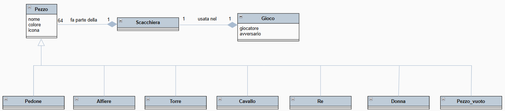
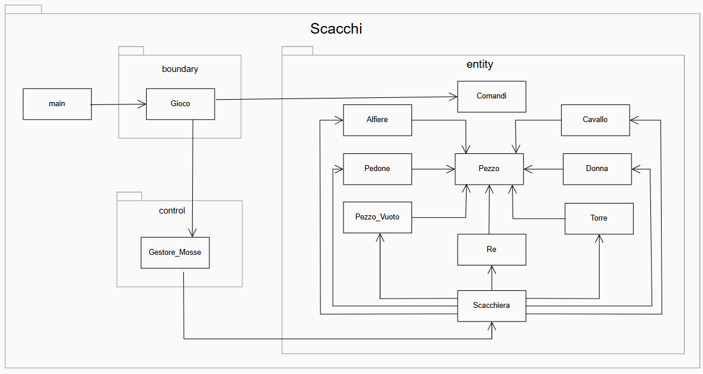
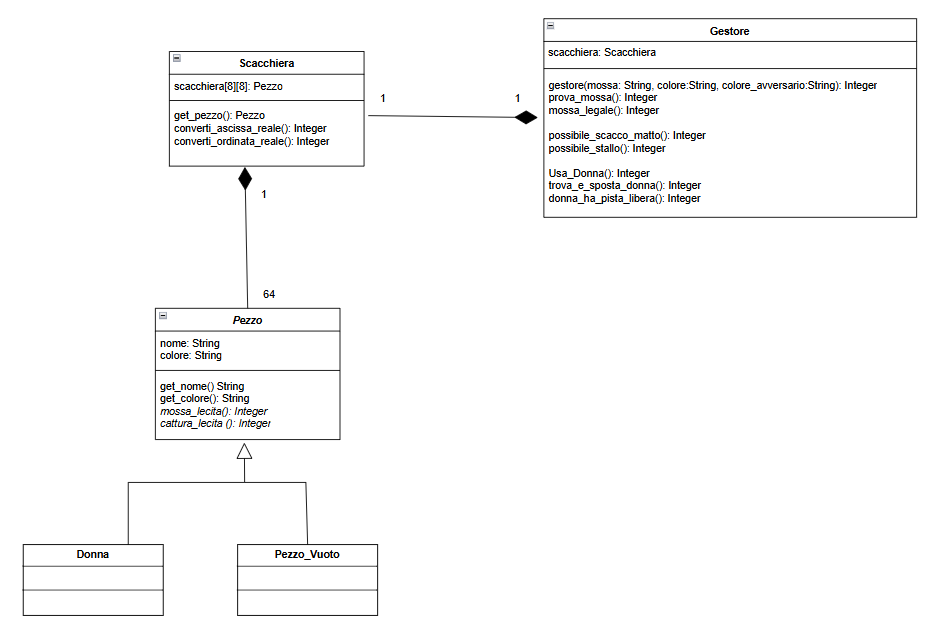
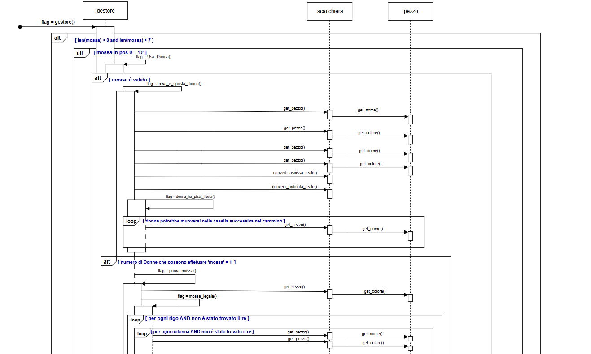
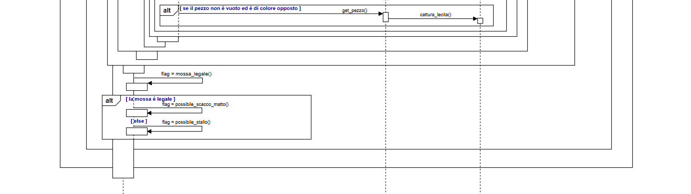
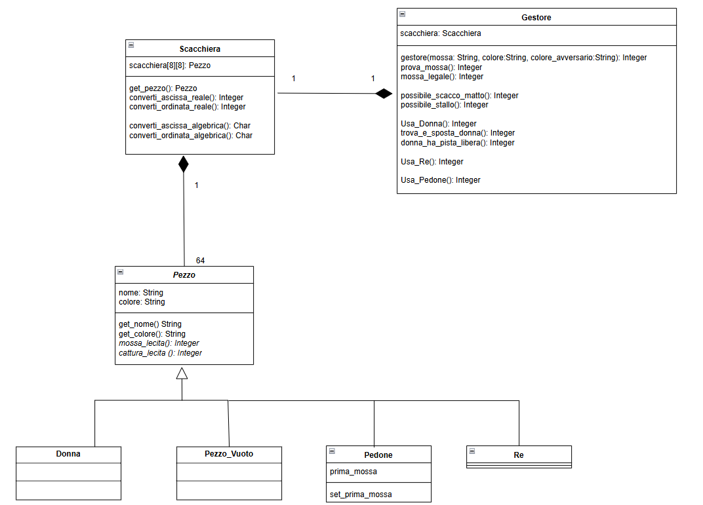
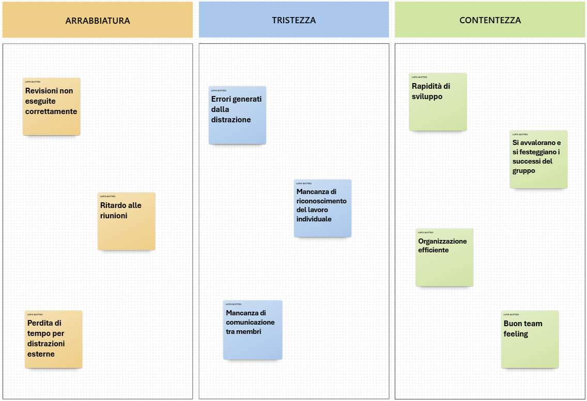
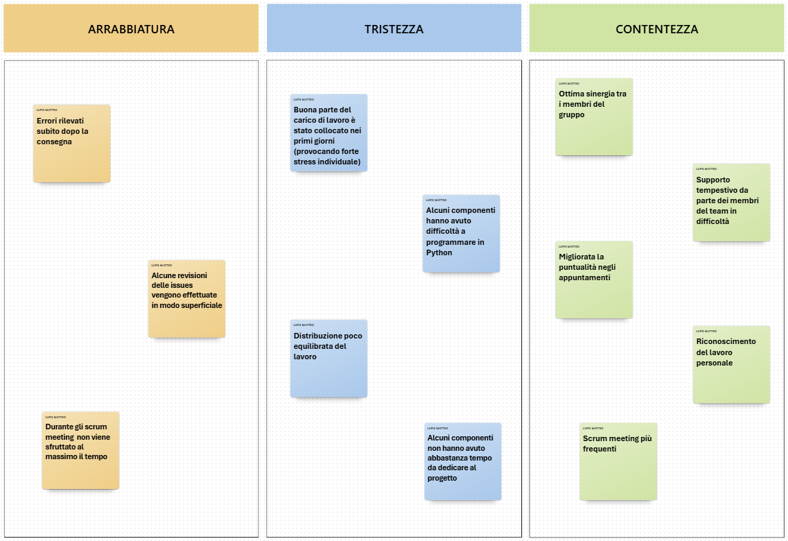

 Indice dei contenuti del Report:
<ol>  
<li><a href="#Introduzione">Introduzione </a></li>
<li><a href="#Modello">Modello di dominio </a></li>
<li><a href="#RequisitiS">Requisiti specifici</a> :
                  <ul>
                  <li><a href="#RequisitiF">Requisiti funzionali </a></li>
                  <li><a href="#RequisitiNF"> Requisiti non funzionali</a></li>
                 </ul>
</li>
<li><a href="#System Design">System Design </a></li>
<li><a href="#OO Design">OO Design </a></li>
<li><a href="#Riepilogo">Riepilogo dei test </a></li>
<li><a href="#Processo">Processo di sviluppo e organizzazione del lavoro </a></li>
<li><a href="#Analisi">Analisi retrospettiva</a> :
                   <ul> 
                    <li><a href="#Sprint0"> Sprint 0 </a></li>
                    <li><a href="#Sprint1"> Sprint 1 </a></li>
                  </ul>
</li>
</ol>

<h2>1. Introduzione</h2>
  
<b>Scacchi</b> è un classico gioco di strategia conosciuto e praticato in tutto il mondo. In questa versione, sviluppata in <b>Python</b>, due giocatori si sfidano alternandosi sullo stesso computer, inserendo le proprie mosse tramite la notazione algebrica (italiana).  
All’avvio del programma è possibile cominciare la partita con il comando <code>/gioca</code>: la partita inizia subito con la scacchiera nella posizione iniziale e i due giocatori si alternano automaticamente nei turni. Il Bianco muove per primo, come da regolamento.  
Le mosse vengono inserite in <a href="https://it.wikipedia.org/wiki/Notazione_algebrica">notazione algebrica (italiana)</a>. Di seguito, alcuni esempi di mosse valide:
<ul><li><code>e4</code> : muove il pedone da e2 a e4</li>
<li><code>Cf3</code> : muove il cavallo sulla casa f3</li></ul>

Durante la partita:
<ul><li>Il programma verifica che le mosse siano lecite</li>
<li>Gestisce l'alternanza dei turni tra i due giocatori</li>
<li>Mostra la scacchiera aggiornata dopo ogni mossa</li>
<li>Tiene traccia dello storico delle mosse effettuate</li></ul>

La partita può concludersi in tre modi:
<ul><li><b>Vittoria</b>: un giocatore dà scacco matto all'avversario</li>
<li><b>Patta</b>: i giocatori raggiungono una situazione di stallo o decidono di comune accordo</li>
<li><b>Abbandono</b>: un giocatore può terminare la partita rinunciando alla vittoria</li></ul> 
  Il gioco degli <b>scacchi</b> è stato realizzato durante il corso di INGEGNERIA DEL SOFTWARE dell'anno accademico 2024-2025 dal gruppo <b>LeCun</b> composto da:  
  <ul><li>Michelangelo Colonna</li>
<li>Roland Dolidze</li>
<li>Francesco Lorusso</li>
<li>Matteo Lupis</li>
<li>Nicolò Tamma</li>
  </ul>

  <a href="#Indice"> Torna all'indice</a>

<h2>2. Modello di dominio</h2>
  

<a href="#Indice"> Torna all'indice</a>

<h2>3. Requisiti</h2>
<ul>
    <li id="RequisitiF">
    <h3>  3.1 Requisiti funzionali</h3>
      
(<i>Definiti nello sprint 1</i>)

      <ul>
  <li>
    <b>RF1 – Visualizzazione dell'help:</b>
    Al comando <code>/help</code> oppure avviando l'app con i flag <code>--help</code> o <code>-h</code>,
    il sistema mostra una descrizione concisa seguita da un elenco di comandi disponibili, come ad esempio:
    <ul>
      <li><code>/gioca</code></li>
      <li><code>/esci</code></li>
      <li><code>/abbandona</code></li>
    </ul>
  </li> 

  <li>
    <b>RF2 – Avvio nuova partita:</b>
    Al comando <code>/gioca</code>, se non è in corso alcuna partita,
    il sistema visualizza la scacchiera con i pezzi nella posizione iniziale e
    si predispone a ricevere la prima mossa del bianco o altri comandi.
  </li> 

  <li>
    <b>RF3 – Visualizzazione scacchiera:</b>
    Al comando <code>/scacchiera</code>, se il gioco non è iniziato,
    il sistema suggerisce il comando <code>/gioca</code>.
    Se il gioco è in corso, mostra la posizione attuale di tutti i pezzi.
  </li> 

  <li>
    <b>RF4 – Abbandono partita:</b>
    Al comando <code>/abbandona</code>, l'app chiede conferma all’utente:
    <ul>
      <li>Se la conferma è positiva, comunica che l’avversario ha vinto per abbandono.</li>
      <li>Se la conferma è negativa, si predispone a ricevere nuovi comandi.</li>
    </ul>
  </li> 

  <li>
    <b>RF5 – Proposta di patta:</b>
    Al comando <code>/patta</code>, l'app chiede conferma all’avversario:
    <ul>
      <li>Se l'avversario accetta, la partita termina in pareggio.</li>
      <li>Se l'avversario rifiuta, il sistema torna in attesa di altri comandi.</li>
    </ul>
  </li> 

  <li>
    <b>RF6 – Uscita dal gioco:</b>
    Al comando <code>/esci</code>, l'app chiede conferma all’utente:
    <ul>
      <li>Se la conferma è positiva, il sistema si chiude restituendo il controllo al sistema operativo.</li>
      <li>Se la conferma è negativa, torna in attesa di altri comandi.</li>
    </ul>
  </li> 

  <li>
    <b>RF7 – Movimento dei pedoni:</b>
    Il sistema deve accettare mosse in notazione algebrica abbreviata (in italiano). Le mosse devono rispettare le regole dei pedoni negli scacchi:
    <ul>
      <li>I pedoni avanzano di una casa, oppure di due se è la loro prima mossa.</li>
      <li>Non possono arretrare.</li>
      <li>Non possono muoversi se bloccati frontalmente.</li>
    </ul>
    Se una mossa non è valida, viene mostrato un messaggio di errore e si attende una nuova mossa. Se valida, viene aggiornata la scacchiera.
  </li> 

  <li>
    <b>RF8 – Visualizzazione cronologia mosse:</b>
    Al comando <code>/mosse</code>, l'app mostra la cronologia delle mosse effettuate usando la <a href="https://it.wikipedia.org/wiki/Notazione_algebrica">notazione algebrica abbreviata (italiana)</a>. Di seguito un esempio:
    <ul>
      <li><code>1.e4 c6</code></li>
      <li><code>2.d4 d5</code></li>
    </ul>
  </li>
</ul>
  
(<i>Definiti nello sprint 2</i>)

    </li>
    <ul>
  <li>
    <b>RF9 – Muovere un pedone con cattura:</b>
    L'app deve accettare mosse in <a href="https://it.wikipedia.org/wiki/Notazione_algebrica">notazione algebrica abbreviata in italiano</a>. 
    Le mosse devono rispettare le regole degli scacchi:
    <ul>
      <li>I pedoni si muovono in avanti di una casa (o due alla prima mossa) e catturano in diagonale.</li>
      <li>Non possono arretrare né muoversi se bloccati frontalmente.</li>
      <li>Se si tenta una mossa non valida viene mostrato il messaggio <i>"mossa illegale"</i> e l'applicazione rimane in attesa di una mossa valida.</li>
    </ul>
  </li> 
</ul>
<ul>
 <li>
   <b>RF10 – Muovere la Donna:</b>
   L'app deve accettare mosse in <a href="https://it.wikipedia.org/wiki/Notazione_algebrica">notazione algebrica abbreviata in italiano</a>:
   <ul>
     <li>La mossa deve rispettare le regole degli scacchi.</li>
     <li>La Donna può catturare pezzi.</li>
     <li>Se si tenta una mossa non valida è mostrato il messaggio <i>"mossa illegale"</i> e l'applicazione rimane in attesa di una mossa valida.</li>
   </ul>
 </li> 
</ul>
<ul>
 <li>
   <b>RF11 – Muovere una Torre:</b>
   L'app deve accettare mosse in <a href="https://it.wikipedia.org/wiki/Notazione_algebrica">notazione algebrica abbreviata in italiano</a>:
   <ul>
     <li>La mossa deve rispettare le regole degli scacchi.</li>
     <li>La Torre può catturare pezzi.</li>
     <li>Se si tenta una mossa non valida è mostrato il messaggio <i>"mossa illegale"</i> e l'applicazione rimane in attesa di una mossa valida.</li>
   </ul>
 </li> 
</ul>
<ul>
 <li>
   <b>RF12 – Muovere un Alfiere:</b>
   L'app deve accettare mosse in <a href="https://it.wikipedia.org/wiki/Notazione_algebrica">notazione algebrica abbreviata in italiano</a>:
   <ul>
     <li>La mossa deve rispettare le regole degli scacchi.</li>
     <li>L'Alfiere può catturare pezzi.</li>
     <li>Se si tenta una mossa non valida è mostrato il messaggio <i>"mossa illegale"</i> e l'applicazione rimane in attesa di una mossa valida.</li>
   </ul>
 </li> 
</ul>
<ul>
  <li>
    <b>RF13 – Muovere un Cavallo:</b>
    L'app deve accettare mosse in <a href="https://it.wikipedia.org/wiki/Notazione_algebrica">notazione algebrica abbreviata in italiano</a>:
    <ul>
      <li>La mossa deve rispettare le regole degli scacchi.</li>
      <li>Il Cavallo può catturare pezzi.</li>
      <li>Se si tenta una mossa non valida è mostrato il messaggio <i>"mossa illegale"</i> e l'applicazione rimane in attesa di una mossa valida.</li>
    </ul>
  </li> 
</ul>
<ul>
 <li>
   <b>RF14 – Muovere il Re senza arrocco:</b>
   L'app deve accettare mosse in <a href="https://it.wikipedia.org/wiki/Notazione_algebrica">notazione algebrica abbreviata in italiano</a>:
   <ul>
     <li>La mossa deve rispettare le regole degli scacchi.</li>
     <li>Il Re non può muoversi in case minacciate da pezzi avversari.</li>
     <li>Il Re può catturare pezzi.</li>
     <li>Se si tenta una mossa non valida è mostrato il messaggio <i>"mossa illegale"</i> e l'applicazione rimane in attesa di una mossa valida.</li>
   </ul>
 </li> 
</ul>
<ul>
 <li>
   <b>RF15 – Giocare un arrocco:</b>
   L'app deve accettare mosse in <a href="https://it.wikipedia.org/wiki/Notazione_algebrica">notazione algebrica abbreviata in italiano</a>:
   <ul>
     <li>La mossa deve rispettare le regole degli scacchi.</li>
     <li>L'arrocco è una mossa speciale del re (una sola volta per partita) che muove il re di due case verso una torre e la torre nella casa tra partenza e arrivo del re.</li>
     <li>Il giocatore non ha ancora mosso né il re né la torre coinvolta nell'arrocco.</li>
     <li>Non ci devono essere pezzi fra il re e la torre utilizzata.</li>
     <li>Né la casa di partenza del re, né quella che attraversa, né quella di arrivo devono essere minacciate da un pezzo avversario.</li>
     <li>L'arrocco corto viene indicato con 0-0.</li>
     <li>L'arrocco lungo viene indicato con 0-0-0.</li>
   </ul>
 </li> 
</ul>
<ul>
 <li>
   <b>RF16 – Promuovere un pedone:</b>
   L'app deve accettare mosse in <a href="https://it.wikipedia.org/wiki/Notazione_algebrica">notazione algebrica abbreviata in italiano</a>:
   <ul>
     <li>La mossa deve rispettare le regole degli scacchi.</li>
     <li>Se un pedone raggiunge l'ottava traversa viene promosso, assumendo il ruolo di un altro pezzo (donna, torre, alfiere o cavallo) a scelta del giocatore.</li>
   </ul>
 </li> 
</ul>
<ul>
  <li>
    <b>RF17 – Mettere un re sotto scacco:</b>
    L'app deve accettare mosse in <a href="https://it.wikipedia.org/wiki/Notazione_algebrica">notazione algebrica abbreviata in italiano</a>:
    <ul>
      <li>La mossa deve rispettare le regole degli scacchi.</li>
      <li>Il re non può mai essere catturato, ma solo minacciato ("sotto scacco").</li>
      <li>Non è consentita alcuna mossa che ponga o lasci il proprio re sotto scacco.</li>
      <li>Per eliminare lo scacco si può: muovere il re, catturare il pezzo che minaccia, o frapporre un pezzo tra il re e l'attaccante.</li>
      <li>Se nessuna mossa può liberare il re dallo scacco, si tratta di scacco matto e la partita termina con la vittoria dell'avversario.</li>
      <li>Se il re non è sotto scacco ma non può muovere legalmente, si tratta di stallo e la partita termina in parità.</li>
    </ul>
  </li>
</ul>
    <li id="RequisitiNF">
    <h3>  3.2 Requisiti non funzionali</h3>
      <ul>
  <li>
    <b>RNF1 – Usabilità:</b>
    L’app deve essere eseguita in un container docker
  </li> 
  <li>
    <b>RNF2 – Portabilità:</b>
    I terminali supportati sono:
    <ul>
      <li>Terminal di Linux</li>
      <li>Terminal di MacOS</li>
      <li>Powershell di Windows</li>
      <li>Git Bash di Windows</li>
  </li> 
      </ul>
  <li>
    <b>RNF3 – Standard Rappresentativo:</b>
    I simboli <a href="https://it.wikipedia.org/wiki/UTF-8"> UTF-8</a> per i pezzi degli scacchi sono: ♔ ♕ ♖ ♗ ♘ ♙ ♚ ♛ ♜ ♝ ♞ ♟. (vedi <a href="https://it.wikipedia.org/wiki/Scacchi#Descrizione_e_regolamento"> link</a>)
  </li> 
</ul>
    </li>
</ul>

<a href="#Indice"> Torna all'indice</a>

  <h2>4. System Design</h2>
        
Nel diagramma dei package che segue (che include anche le dipendenze tra le classi), sono stati omessi i file <code>__init__.py</code> in quanto il loro utilizzo è una peculiarità del linguaggio Python, utilizzato unicamente per definire i package a livello tecnico. Non avendo una valenza concettuale nel contesto UML, la sua rappresentazione è stata ritenuta non necessaria da parte del team.
 
        
    
        
  
Abbiamo suddiviso i moduli del sistema nei package <code>boundary</code>, <code>control</code> e <code>entity</code>, seguendo il pattern architetturale Model-View-Control (<strong>MVC</strong>, ovvero <strong>Modello-Vista-Controllo</strong>) per garantire una separazione chiara delle responsabilità e favorire la manutenibilità del codice. Questa scelta risponde sia a esigenze tecniche sia a requisiti non funzionali specifici del progetto.

        
  
Il package <code>boundary</code> contiene le componenti legate all'interfaccia utente testuale, in linea con <strong>RNF1 (Usabilità)</strong> e <strong>RNF2 (Portabilità)</strong>: l'applicazione è eseguibile in un container Docker e compatibile con diversi terminali (Linux, MacOS, PowerShell e Git Bash per Windows). Isolare l'interazione con l'utente in un package specifico ci consente di adattare facilmente l'interfaccia o sostituirla, se necessario, senza toccare la logica del gioco o i dati sottostanti.

        
  
Il package <code>control</code> gestisce la logica applicativa e il coordinamento tra boundary ed entity, rendendo il sistema modulare e facilmente estendibile. Questa struttura ci ha permesso di centralizzare la gestione delle partite e delle regole, migliorando la chiarezza del flusso logico e facilitando l'eventuale gestione futura di stati o modalità di gioco diverse.

        
  
Il package <code>entity</code> raccoglie le classi che rappresentano i dati fondamentali del dominio, come <code>Pezzo</code> o <code>Scacchiera</code>, rispettando <strong>RNF3 (Standard Rappresentativo)</strong>. In questo package vengono gestiti i simboli UTF-8 degli scacchi, che garantiscono una rappresentazione standardizzata, compatibile con tutti i terminali previsti.

        
  
Questa organizzazione in tre package è stata adottata <strong>anche per rispettare il principio di rappresentazione separata</strong>, assicurando che ogni tipo di informazione o responsabilità sia collocata nel livello più appropriato del sistema.

  <a href="#Indice"> Torna all'indice</a>

  <h2>5. OO Design</h2>
  <ul><li><b><h2>Decisioni prese in riferimento ai principi di progettazione Object Oriented</h2></b>
Durante lo sviluppo del gioco degli scacchi in Python, abbiamo posto particolare attenzione al rispetto dei principi della programmazione orientata agli oggetti, con un'enfasi sull'application dell'<b>information hiding</b>, nonostante la natura dinamica del linguaggio non preveda un sistema di visibilità formale come in altri linguaggi (ad esempio Java o C++).  
In Python, infatti, non esistono modificatori di accesso espliciti come <code>private</code> o <code>protected</code>. Tuttavia, abbiamo simulato il concetto di incapsulamento e nascosto i dettagli interni delle classi tramite la <b>definizione di metodi accessori (getter e setter)</b>, garantendo così una corretta separazione delle responsabilità tra le componenti del sistema.  
In particolare, nella classe <b>Scacchiera</b> è stato implementato il metodo <code>get_pezzo()</code> per accedere in modo controllato ai pezzi presenti sulla scacchiera, impedendo l'accesso diretto alla struttura dati interna. Analogamente, nella classe <b>Pezzo</b> sono stati definiti i metodi <code>get_nome()</code>, <code>get_icona()</code> e <code>get_colore()</code> per esporre le informazioni rilevanti del pezzo senza compromettere la coerenza del suo stato interno.  
Questo approccio promuove la <b>modularità</b> e migliora la <b>manutenibilità</b> del codice, consentendo modifiche future (ad esempio al modo in cui vengono rappresentati o gestiti i pezzi) senza dover intervenire in modo invasivo sulle classi che li utilizzano.  
Inoltre, nella progettazione del gioco non è stato abusato del meccanismo di ereditarietà, che è stato impiegato solo dove realmente utile, ad esempio per definire la gerarchia tra i tipi di pezzi (come Torre, Alfiere, Cavallo, ecc.), preferendo invece la <b>composizione</b> nei casi in cui essa garantisse una maggiore flessibilità e un minore accoppiamento tra le classi (come nel caso della Scacchiera contenuta nel Gestore_Mosse).  
Tutte queste scelte sono state fatte nell'ottica di ridurre il <b>debito tecnico</b> e garantire un codice robusto, chiaro e facilmente estendibile. Abbiamo cercato di realizzare una struttura solida e coerente, in grado di evolversi nel tempo senza introdurre complessità inutili o rischi di regressioni.</li>
  
Di seguito sono rappresentati rispettivamente il diagramma delle classi e il diagramma di sequenza delle user story che abbiamo ritenuto piu impotanti:<li>
<h2>Diagramma delle Classi e diagramma di Sequenza della user story: Usare la Donna</h2> 
      
  
    </li>
  <li><h2>Diagramma delle Classi e diagramma di Sequenza della user story: Verificare lo Scacco Matto</h2>
    
  
    </li></ul>
  <a href="#Indice"> Torna all'indice</a>

  <h2>6. Riepilogo dei test</h2>
  A causa dei vincoli temporali stringenti, è stato adottato un approccio pratico per la definizione dei test automatici eseguiti tramite <b>Pytest</b>. In particolare, si è scelto di utilizzare le classi di equivalenza con approccio <a href="https://thecodest.co/it/dizionario/che-cose-il-black-box-testing/">black box</a>, che consente di coprire efficacemente il comportamento del software testando solo i casi rappresentativi, senza esaminare ogni input possibile. 
Questo metodo permette di:  
<ul><li>Ottimizzare i tempi identificando rapidamente i casi rilevanti.</li>
<li>Garantire una copertura sistematica delle funzionalità principali.</li>
<li>Ridurre la ridondanza mantenendo alta la qualità della verifica.</li></ul> 
Per il dimensionamento delle test suite, si è optato per una distribuzione proporzionale all'importanza dei singoli moduli: quelli di tipo <b>Control</b> (più complessi e rilevanti) hanno ricevuto una test suite più ampia, mentre quelli di tipo <b>Entity</b> sono stati testati in maniera leggermente ridotta ma comunque significativa.  
In sintesi, nonostante le tempistiche limitate, si è adottato un approccio strutturato che massimizza l'efficacia della validazione del sistema, ottimizzando l'uso delle risorse disponibili. I test eseguiti in maniera automatica da <b>Pytest</b> hanno prodotto dei risultati positivi, in linea con quelli che ci aspettavamo di ricevere.  
Entrando più nel dettaglio, ha ricevuto maggiore interesse il modulo <b>gestore</b>, in quanto rappresenta il cuore della logica del gioco e incorpora la maggior parte delle funzionalità fondamentali per il corretto funzionamento del sistema.  
  <a href="#Indice"> Torna all'indice</a>

  <h2>7. Processo di sviluppo e organizzazione del lavoro</h2>
  Lo sviluppo del progetto Scacchi è stato condotto seguendo un approccio ispirato alla metodologia <a href="https://it.wikipedia.org/wiki/Scrum_%28informatica%29">SCRUM</a>.  
Il processo si è articolato in tre sprint di durata variabile (definita dal docente), strutturati nel seguente modo:  
<ul><li>Il docente ha ricoperto il ruolo di <i>Product Owner</i>. 
La comunicazione ufficiale relativa agli Sprint è avvenuta tramite <b>MS Teams</b>, attraverso messaggi e mediante documenti Word (es. Sprint Backlog, User Stories, ...).  </li>
<li>La suddivisione dei compiti è avvenuta in modo collaborativo e flessibile: non sono stati assegnati ruoli rigidi e ogni membro del team si è proposto spontaneamente per svolgere determinati incarichi.  </li>
<li>Abbiamo scelto di adottare una modalità di lavoro basata sulla <i><a href="https://en.wikipedia.org/wiki/Peer_review">Peer Review</a></i>, supportandoci a vicenda in modo spontaneo e reciproco, cercando di minimizzare gli errori individuali causati da distrazione. 
La ripartizione iniziale delle attività è stata effettuata durante specifici <i>Scrum Meeting</i> che hanno fornito la base per l'organizzazione di ciascuno sprint. Durante questi si è mantenuto un atteggiamento flessibile, aperto alla riassegnazione dei compiti qualora necessario sulla base degli imprevisti e degli impegni individuali dei membri del gruppo.  </li>
<li>La gestione delle attività è stata affidata alle <i>Project Board</i> di <b>GitHub</b>, organizzate secondo il modello <a href="https://it.wikipedia.org/wiki/Kanban">Kanban</a>, suddiviso in cinque colonne:<ul> 
<li><b>TO DO</b>: attività da iniziare</li>
<li><b>IN PROGRESS</b>: attività in corso di sviluppo</li>
<li><b>REVIEW</b>: attività in attesa di revisione da parte di altri membri del team</li>
<li><b>READY</b>: attività completate e revisionate dal team, in attesa dell'approvazione finale del <i>Product Owner</i></li>
<li><b>DONE</b>: attività ultimate e approvate dal <i>Product Owner</i>  </li></ul></li>
<li>Per l'integrazione del codice è stato adottato il <i><b>GitHub Flow</b></i>. 
  Ogni issue è stata assegnata a uno o due membri del team, che hanno lavorato su <b>branch dedicati</b> per implementare le modifiche richieste. In seguito al completamento del codice e al superamento dei test effettuati da almeno uno/due componenti del team, i branch sono stati pushati sul repository remoto, dove è stata effettuata la revisione del codice e dove si è controllato l'esito dei controlli statici da parte di <b>Ruff</b> e di test automatici da parte di <b>Pytest</b>. Risolti eventuali conflitti, i branch sono stati poi integrati (<i><b>merge</b></i>) nel ramo principale (<code>master</code>). Dopo aver integrato i singoli branch, i membri del team hanno verificato la corretta creazione dell'immagine docker. 
Grazie a questa metodologia, siamo riusciti a mantenere un flusso di lavoro sufficentemente ordinato e organizzato, utilizzando <b>GitHub</b> come piattaforma collaborativa per gestire modifiche, revisioni e integrazioni al progetto.  </li>
<li>Infine, durante l’intera durata degli sprint, abbiamo organizzato brevi incontri quotidiani (distinti dai tradizionali scrum meeting per la loro maggiore sintesi). Questi daily meeting si svolgevano solitamente all’arrivo dei membri nel dipartimento di informatica, con l’obiettivo di favorire l’allineamento del team e la pianificazione delle attività giornaliere.</li>
</ul>
  <a href="#Indice"> Torna all'indice</a>

<h2>8. Analisi retrospettiva</h2>
  <ul>
    <li id="Sprint0">
    <h3>8.1 Sprint 0</h3>
    
  
    Il meeting di retrospettiva è stato svolto il 03/05/2025 in videochiamata su <b>Google Meet</b>.  
    L'incontro ha preso avvio con un confronto informale tra i componenti del gruppo, finalizzato a esplorare in profondità le dinamiche emerse durante lo Sprint 0. L'obiettivo principale è stato analizzare criticamente l'esperienza vissuta, identificando tanto le difficoltà quanto le potenzialità del lavoro svolto.  
    Il team ha adottato come riferimento il diagramma retrospettivo "Arrabbiato/triste/felice". Ogni membro ha condiviso le proprie impressioni, in seguito annotate sulla whiteboard permettendo una mappatura emotiva e professionale dell'esperienza.

## Analisi delle criticità

L'analisi ha messo in luce una serie di criticità che sono state così mappate: 
    <ul><li>Per quanto riguarda l'arrabbiatura, sono emerse problematiche legate a:<ul>
    <li>Revisioni non eseguite correttamente, che generano frustrazione e rallentamenti</li>
    <li>Ritardi nelle riunioni che compromettono l'efficienza complessiva</li>
    <li>Disperdimento di energie in distrazioni esterne che frammentano la concentrazione</li></ul></li> 
    <li>Per quanto concerne la tristezza, il team ha evidenziato:<ul>
    <li>Errori generati dalla distrazione</li>
    <li>Mancanza di riconoscimento del lavoro individuale</li>
    <li>Insufficiente comunicazione tra i membri del gruppo</li></ul></li></ul> 
    Le indicazioni emerse saranno oggetto di attenta valutazione e implementazione nelle fasi successive del progetto, con l'intento di ottimizzare i processi, migliorare la comunicazione e valorizzare il contributo di ciascun membro del team.

    
## Azioni correttive concordate dal team

Al fine di migliorare la qualità del lavoro e la collaborazione all’interno del gruppo, il team ha individuato e deciso di mettere in atto le seguenti azioni correttive: 
<ul><li><h4>Miglioramento delle revisioni</h4>
    Ogni membro del team, per garantire maggior affidabilità al progetto si impegnerà a visionare attentamente tutte le modifiche effettuate e all'occorrenza anche testare le parti relativi al codice.</li>
    <li><h4>Puntualità nelle riunioni giornaliere</h4>
    Per ridurre i ritardi, le riunioni giornaliere saranno fissate a un orario stabile e comunicato con chiarezza. Verranno utilizzati promemoria automatici e si presterà maggiore attenzione al rispetto dei tempi, mantenendo gli incontri brevi e mirati.</li>
    <li><h4>Riconoscimento del lavoro individuale</h4>
    Il team si impegnerà a valorizzare maggiormente il contributo dei singoli, prevedendo momenti dedicati al riconoscimento durante le riunioni e promuovendo un feedback costruttivo e tempestivo.</li>
    <li><h4>Rafforzamento della comunicazione interna</h4>
    Per migliorare la comunicazione tra i membri, verranno utilizzati con maggiore costanza gli strumenti digitali di comunicazione (come chat, email ecc.) e saranno incoraggiati momenti regolari di aggiornamento e confronto.</li>
</ul> 
    Queste azioni saranno monitorate nel tempo per valutarne l’efficacia e apportare eventuali ulteriori miglioramenti.

       <li id="Sprint1">
        <h3>8.2 Sprint 1</h3></li>
          
        Il meeting di retrospettiva si è svolto il <b>03/06/2025</b> in presenza, a differenza dello Sprint 0.  
L'incontro è iniziato con un confronto informale tra i membri del gruppo, finalizzato ad approfondire le dinamiche emerse durante lo Sprint 0. L'obiettivo principale è stato quello di analizzare in modo critico l'esperienza vissuta, individuando le difficoltà incontrate e cercando strategie per migliorarle.  
La fase successiva si è svolta in modo del tutto analogo al meeting dello Sprint 0. Infatti il team ha utilizzato come riferimento il diagramma retrospettivo "Arrabbiato/Triste/Felice". Ogni componente ha condiviso le proprie impressioni, successivamente annotate sulla whiteboard, consentendo così una mappatura sia emotiva che professionale dell'esperienza.

## Analisi delle criticità

L'analisi ha evidenziato una serie di criticità, che sono state così mappate: 
<ul><li>Per quanto riguarda gli aspetti legati all'arrabbiatura, sono emerse problematiche relative a:<ul>
<li>Errori rilevati subito dopo la consegna</li>
<li>Revisioni delle Issues svolte in modo superficiale</li>
<li>Tempo non sfruttato al meglio durante gli scrum meeting</li></ul></li> 
<li>Relativamente alla tristezza, il team ha segnalato:<ul>
<li>Un'eccessiva concentrazione del carico di lavoro nei primi giorni, con conseguente stress individuale</li>
<li>Difficoltà, da parte di alcuni componenti, nella programmazione in Python</li>
<li>Distribuzione non equa delle attività</li>
<li>Limitata disponibilità di tempo da parte di alcuni membri da dedicare al progetto</li></ul></li></ul> 
Le indicazioni emerse saranno analizzate con attenzione e integrate nelle fasi successive del progetto, con l'obiettivo di ottimizzare i processi, potenziare la comunicazione e valorizzare al meglio il contributo di ogni membro del team.

## Azioni correttive concordate dal team

In prospettiva di un futuro Sprint 3, al fine di migliorare la qualità del lavoro e la collaborazione all'interno del gruppo, il team ha individuato e deciso di mettere in atto le seguenti azioni correttive: 
<ul><li><h4>Potenziamento delle revisioni e dei controlli di qualità</h4>
Per evitare errori successivi alla consegna e revisioni superficiali, ogni membro del team si impegnerà a effettuare controlli più accurati sulle Issues, con una particolare attenzione alla verifica del codice prodotto.</li>
<li><h4>Riallocazione bilanciata delle Issues</h4>
Per compensare la distribuzione sbilanciata del carico di lavoro emersa nello sprint precedente, le Issues di questo sprint sono state assegnate tenendo conto della loro complessità. Alcuni membri hanno assunto un numero minore di Issues più impegnative, mentre altri si sono occupati di un numero maggiore di Issues meno complesse, favorendo così un equilibrio più equo tra i carichi individuali.</li>
<li><h4>Riorganizzazione del carico di lavoro e della pianificazione</h4>
Per prevenire sovraccarichi iniziali e stress individuali, il team distribuirà in modo più bilanciato le attività lungo l'intero sprint. La pianificazione sarà condivisa e aggiornata regolarmente, tenendo conto delle competenze e della disponibilità effettiva di ciascun membro.</li>
<li><h4>Supporto reciproco e sviluppo delle competenze</h4>
In risposta alle difficoltà riscontrate da alcuni membri nella programmazione in Python, verranno promossi momenti di confronto tecnico. Questo approccio aiuterà a rafforzare le competenze individuali e a favorire una maggiore collaborazione all'interno del gruppo.</li>
</ul> 
Queste azioni saranno monitorate nel tempo per valutarne l'efficacia e apportare eventuali ulteriori miglioramenti.

## Riconoscimento dei miglioramenti

Al termine dello Sprint 1, il team ha notato un discreto miglioramento per quanto concerne il lavoro in gruppo, sono stati registrati tali miglioramenti nella sezione "contentezza" della whiteboard. Tra gli aspetti più positivi emersi: 
<ul><li>Ottima sinergia e collaborazione tra i membri del gruppo</li>
<li>Maggiore puntualità e rispetto degli orari fissati per gli appuntamenti</li>
<li>Supporto rapido e costante offerto ai membri del team che hanno incontrato difficoltà</li>
<li>Scrum meeting più frequenti per migliorare e ottimizzare il lavoro di gruppo, come richiesto nel meeting retrospettivo effettuato all'inizio dello sprint 1</li></ul> 
Questi progressi testimoniano l'efficacia delle prime azioni correttive e il crescente affiatamento del gruppo.

</li>
</ul>

<a href="#Indice"> Torna all'indice</a>
